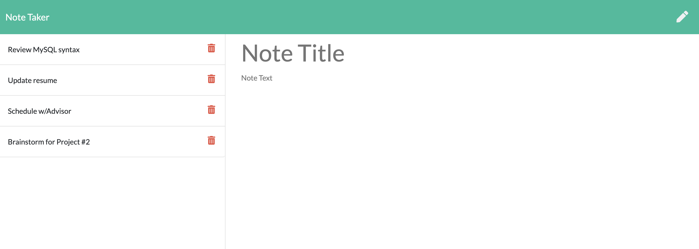

# Note Taker
     

## Description
AS A small business owner
I WANT to be able to write and save notes
SO THAT I can organize my thoughts and keep track of tasks I need to complete.   

## Table of Contents
#### [Installation](#Installation)  
#### [Usage](#Usage)  
#### [License](#License)  
#### [Contributing](#Contributing)  
#### [Tests](#Tests)  
#### [Questions](#Questions)   

## Installation
Navigate to https://thawing-reaches-34378.herokuapp.com/ in any web browser to use the application.
  

## Usage

When the user navigates to the above URL, they are presented with a landing page with a link to a notes page. Once they click on the link to the notes page, they are presented with a page with existing notes listed in the left-hand column, plus empty fields to enter a new note title and text in the right-hand column.

From here, the user can enter a new note title and text. A save icon will appear in the navigation at the top of the page. Once the save icon is clicked, the user's note is saved and will appear in the left-hand column with the other existing notes.

If the user clicks an existing note in the list in the left-hand column, that note appears in the right-hand column.

If the user clicks the Write icon in the navigation at the top of the page, they will be presented with empty fields to enter a new note title and text.

Example screenshot:

  

## License
[https://opensource.org/licenses/MITnse](https://opensource.org/licenses/MITnse) 
  
        Copyright (c) (year) (copyright holders)

        Permission is hereby granted, free of charge, to any person obtaining a copy of this software and associated documentation files (the "Software"), to deal in the Software without restriction, including without limitation the rights to use, copy, modify, merge, publish, distribute, sublicense, and/or sell copies of the Software, and to permit persons to whom the Software is furnished to do so, subject to the following conditions:
        
        The above copyright notice and this permission notice (including the next paragraph) shall be included in all copies or substantial portions of the Software.
        
        THE SOFTWARE IS PROVIDED "AS IS", WITHOUT WARRANTY OF ANY KIND, EXPRESS OR IMPLIED, INCLUDING BUT NOT LIMITED TO THE WARRANTIES OF MERCHANTABILITY, FITNESS FOR A PARTICULAR PURPOSE AND NONINFRINGEMENT. IN NO EVENT SHALL THE AUTHORS OR COPYRIGHT HOLDERS BE LIABLE FOR ANY CLAIM, DAMAGES OR OTHER LIABILITY, WHETHER IN AN ACTION OF CONTRACT, TORT OR OTHERWISE, ARISING FROM, OUT OF OR IN CONNECTION WITH THE SOFTWARE OR THE USE OR OTHER DEALINGS IN THE SOFTWARE.
 

## Contributing
Fork the repo and create your branch from "main". Issue a pull request and describe the changes you're proposing.  

## Tests
Run 'npm tests' from the command line.  

## Questions
[Find me on GitHub](https://github.com/kvaden19) 
[Email me](mailto:klvaden@gmail.com)  